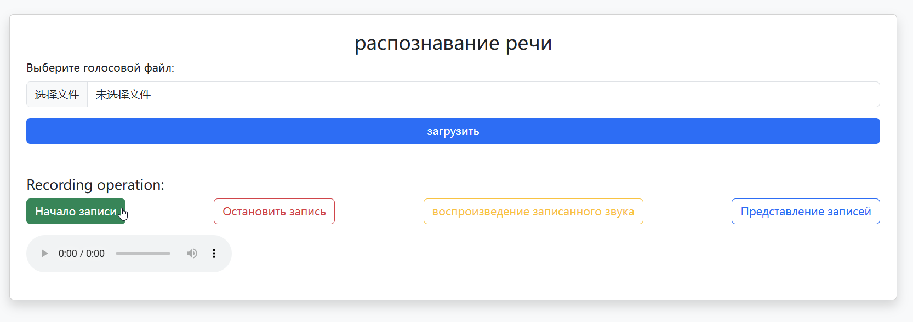

## 依赖包 пакет зависимостей

```text
torch==2.3.0
Levenshtein==0.20.2
librosa==0.10.2.post1
tensorboardX==2.1
ctcdecode==1.0.2
pycorrector==0.3.0
sounddevice==0.4.1
PyAudio==0.2.14
Flask==3.1.0
Flask-Cors==5.0.0
tqdm==4.50.2
joblib==1.4.2
Werkzeug==3.1.3
gunicorn==20.0.4
```

----pyaudio----

#linux
```shell
apt-get install libasound-dev portaudio19-dev libportaudio2 libportaudiocpp0 portaudio19-dev python-all-dev python3-all-dev
pip install pyaudio
```

----ctcdecode安装解决方案----
----ctcdecode решение для установки ----
```shell
pip install torch==2.3.0 torchvision torchaudio
git clone --recursive https://github.com/WayenVan/ctcdecode.git
cd ctcdecode && pip install .
```

----导入soundfile时提示 OSError: sndfile library not found----
```shell
apt-get install libsndfile1
```

## 模型预测(server) Предсказание модели (сервер)

```shell
python masr_server.python
```
网页界面显示 Отображение веб-интерфейса<br>


## 构建Docker镜像 Создание образа Docker

```shell
docker build -t chinese-speech-recognition-server .
```

## 运行Docker容器 Запуск контейнера Docker

```shell
docker run -d -p 5000:5000 chinese-speech-recognition-server
```
