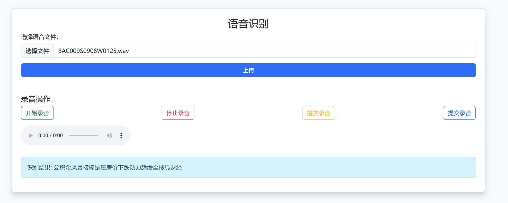

## 依赖包

```text
torch==2.3.0
Levenshtein==0.20.2
librosa==0.10.2.post1
tensorboardX==2.1
ctcdecode==1.0.2
pycorrector==0.3.0
sounddevice==0.4.1
PyAudio==0.2.14
Flask==3.1.0
Flask-Cors==5.0.0
tqdm==4.50.2
joblib==1.4.2
Werkzeug==3.1.3
gunicorn==20.0.4
```

----pyaudio安装比较麻烦，解决方案----

#linux下参考
```shell
apt-get install libasound-dev portaudio19-dev libportaudio2 libportaudiocpp0 portaudio19-dev python-all-dev python3-all-dev
pip install pyaudio
```

----ctcdecode安装解决方案----
```shell
pip install torch==2.3.0 torchvision torchaudio
git clone --recursive https://github.com/WayenVan/ctcdecode.git
cd ctcdecode && pip install .
```

----导入soundfile时提示 OSError: sndfile library not found----
```shell
apt-get install libsndfile1
```


## 数据和模型下载地址

| 训练数据及模型 | 下载链接 |
| :---: | :---: |
| AISHELL-1数据集下载 | [点击下载](http://www.aishelltech.com/kysjcp) |
| ST-Chinese-Mandarin-Corpus数据集下载 | [点击下载](http://www.openslr.org/resources/38) |
| THCHS-30数据集下载 | [点击下载](http://www.openslr.org/resources/18) |
| LM语言模型zh_giga.no_cna_cmn.prune01244.klm | [点击下载](https://deepspeech.bj.bcebos.com/zh_lm/zh_giga.no_cna_cmn.prune01244.klm) |
| LM超大语言模型zhidao_giga.klm(70G) | [点击下载](https://deepspeech.bj.bcebos.com/zh_lm/zhidao_giga.klm) |
| 预训练模型（aishell-1数据集训练） | [点击下载](https://download.csdn.net/download/quantbaby/15909010) |
| 预训练模型（aishell, ST-CMC, thchs-30训练） | [点击下载](https://share.weiyun.com/3VWtGUBo) |
| 预训练模型（超大数据集训练，1300h+） | [点击下载](https://share.weiyun.com/drQfaovf) |

**AISHELL-1数据集下载后解压放到data_aishell对应文件夹下**

## 模型预测(server)

起flask服务进行预测
```shell
python masr_server.python
```
网页界面显示<br>

