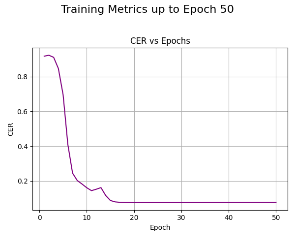

# Chinese-Speech-Recognition-Project
## The team members are ：
- `YANG TIANYU`
- `FU ZUHE`
- `Ху Юйхан`：отвечает за предобработку данных.
- `Шэнь Жуйцзи`：отвечает за обучение модели.
### `requirements.txt`: 
```text
torch==1.6.0
Levenshtein==0.12.0
librosa==0.8.0
warpctc_pytorch==0.2.1
tensorboardX==2.1
ctcdecode==1.0.2
pycorrector==0.3.0 #Chinese Text Error Corrector
sounddevice==0.4.1
pyaudio==0.2.11
Flask==1.1.2
Flask-Cors==3.0.9
tqdm==4.50.2
joblib==1.0.0
werkzeug==1.0.0
gunicorn==20.0.4
```
### Датасет: это [THCHS-30](https://www.openslr.org/18/), который является открытым китайским речевым корпусом, выпущенным [Центром технологий речи и языка (CSLT)](https://www.openslr.org/18/)) Тсиньхуаского университета.



На приведенной выше диаграмме показано изменение CER (Character Error Rate) на валидационном наборе данных по мере прохождения эпох обучения.

## Предобработка данных （Ху Юйхан ）

### 1.1. `config.py`: Этот файл является конфигурационным файлом, в котором хранятся пути к данным, модели и т.д.
### 1.2. `data_preprocessing.py`: Этот скрипт читает данные и обрабатывает исходные данные, чтобы получить следующие три файла:
- `train.index`
- `dev.index`
- `labels.gz`
Файлы `train.index` и `dev.index` являются индексными файлами, которые представляют собой соответствие между аудиофайлами и их аннотациями.
Файл `labels.gz` является сжатым файлом, содержащим все символы, которые встречаются в аннотациях данных, представленных в виде списка.
### 1.3. `processing_labels_gz.ipynb`: Этот файл предназначен для обработки labels.gz и удаления всех символов, кроме китайских.


## Модельное обучение 50 epochs ( Шэнь Жуйцзи)
## 1. файл обучения модели
### 1.1. `train.py`: Этот код является основным кодом, который обучает модель на основе GatedConv и одновременно вычисляет и выводит кривую CER (коэффициент ошибок символов).
### 1.2. `data.py`: В этом коде осуществляется подготовка и загрузка данных, необходимых для задачи.
### 1.3. `feature.py`: Загрузка аудиофайла и его преобразование в логарифмическую амплитудную спектрограмму (log-magnitude spectrogram).
### 1.4. `decoder.py`: Определение класса Decoder и его подкласса GreedyDecoder для обработки задач декодирования в речевом распознавании.

### 2. Папка
### 2.1. Папка `processed`:В этой папке хранятся файлы после предобработки, включая:train.index,dev.index,labels.gz.
### 2.2. Папка `pretrained`:В этой папке хранятся модели после обучения.
### 2.3. Папка `plots`:В этой папке хранятся графики результатов CER (Character Error Rate).
### 2.4. Папка `data`:В этой папке хранятся исходные наборы данных:
- `train` (тренировочный набор)
- `dev` (набор для валидации)
### 2.5. Папка `models`:В данной папке определены модель, её обучение и оценка.

